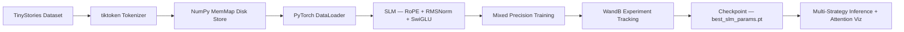

<h1 align="center">🧠 Advanced Small Language Model (SLM) from Scratch</h1>
<h3 align="center">LLaMA/Mistral-Style Architecture with RoPE · RMSNorm · SwiGLU · WandB</h3>

<p align="center">
  
  
  
  
  
  
</p>

---

## 🌟 Overview

This project implements a **production-grade Small Language Model (SLM) trained from scratch** using a modern LLaMA/Mistral-style Transformer architecture. It is not a wrapper around a pre-trained model — every weight is initialized randomly and trained end-to-end on the **TinyStories** dataset.

The goal was to go beyond a standard GPT-2 clone and implement the **exact architectural improvements** that distinguish modern LLMs (LLaMA 1/2/3, Mistral, Gemma, PaLM) from earlier GPT-style models — specifically **Rotary Positional Embeddings (RoPE)**, **RMSNorm**, and **SwiGLU** activations.

The model generates coherent, contextually consistent short stories, demonstrating end-to-end mastery of the pre-training pipeline: data ingestion, tokenization, batch construction, architecture design, training with mixed precision, evaluation with perplexity, and multi-strategy inference.

---

## 🚀 Key Highlights

- 🔁 **RoPE** — Position encoded inside attention via complex rotation; no learned positional table
- ⚡ **RMSNorm** — Faster normalization than LayerNorm; no mean subtraction or bias
- 🔥 **SwiGLU** — Gated activation `SiLU(xW₁) ⊙ xW₃` used in LLaMA, PaLM, Mistral, Gemma
- 🎯 **Flash Attention** — `F.scaled_dot_product_attention` for O(N) memory attention when available
- 📊 **WandB Integration** — Full experiment tracking (loss, perplexity, LR curve, hyperparameters)
- 🧮 **Perplexity Metric** — Standard LLM evaluation metric tracked throughout training
- 🔍 **Attention Visualization** — Multi-head attention heatmaps per layer for interpretability
- 🧠 **Multi-Strategy Decoding** — Greedy · Top-k · Nucleus (Top-p) · Beam Search

---

## 💥 Architecture Comparison

| Component | GPT-2 Baseline | **This Project (LLaMA-Style)** |
|---|---|---|
| Positional Encoding | Learned absolute `wpe` table | **RoPE** — rotates Q/K in attention space |
| Normalization | LayerNorm (mean + variance, bias) | **RMSNorm** — root-mean-square only, no bias |
| MLP Activation | GELU (`4×` linear) | **SwiGLU** (`8/3×` gated linear) |
| Attention | Fused QKV projection | **Separate Q, K, V projections** (no bias) |
| Attention Compute | Manual softmax | **Flash Attention** (PyTorch SDPA) |
| Normalization Style | Post-norm | **Pre-norm** (better training stability) |
| Sampling | Top-k only | **Top-k + Top-p + Beam Search** |
| Metrics | Train/Val Loss | **Loss + Perplexity + Grad Norm** |
| Tracking | None | **Weights & Biases** full dashboard |
| Interpretability | None | **Per-layer attention heatmaps** |

---

## 🛠 Tech Stack



---

## 🏗️ Model Architecture

```text
Input Token IDs
      │
      ▼
┌─────────────────────────┐
│   Token Embedding (wte) │  ← No positional embedding table (RoPE handles position)
└─────────────────────────┘
      │
      ▼
┌─────────────────────────────────────────┐  ×N layers
│             Transformer Block           │
│                                         │
│   ┌──────────┐    ┌───────────────────┐ │
│   │ RMSNorm  │ →  │ CausalSelfAttn    │ │
│   └──────────┘    │  + RoPE on Q,K    │ │
│                   │  + Flash Attention│ │
│                   └───────────────────┘ │
│         (residual connection)           │
│   ┌──────────┐    ┌───────────────────┐ │
│   │ RMSNorm  │ →  │ SwiGLU MLP        │ │
│   └──────────┘    │  SiLU(xW1)⊙xW3   │ │
│                   └───────────────────┘ │
│         (residual connection)           │
└─────────────────────────────────────────┘
      │
      ▼
┌─────────────────────────┐
│      Final RMSNorm      │
└─────────────────────────┘
      │
      ▼
┌─────────────────────────┐
│     LM Head (linear)    │  ← Weight-tied with token embedding
└─────────────────────────┘
      │
      ▼
   Logits → Cross-Entropy Loss / Token Sampling
```

---

## 📐 Model Configuration

```python
SLMConfig(
    vocab_size  = 50257,    # GPT-2 BPE tokenizer
    block_size  = 128,      # Context / sequence length
    n_layer     = 6,        # Transformer blocks
    n_head      = 6,        # Attention heads
    n_embd      = 384,      # Embedding dimension
    dropout     = 0.1,
    rope_theta  = 10000.0,  # RoPE base frequency
)
```

### 📊 Parameter Breakdown (~30M total)

| Component | Parameters | Share |
|---|---|---|
| Token Embedding (`wte`) | ~19.3M | ~64% |
| Attention (Q, K, V, Out) | ~5.3M | ~18% |
| SwiGLU MLP (W1, W2, W3) | ~5.0M | ~17% |
| RMSNorm (all layers) | ~5K | <1% |
| **Total** | **~30M** | — |

> Weight tying means the LM head shares weights with `wte`, so no additional parameters are added for the output projection.

---

## 🔑 Core Architectural Innovations

### 1. 🌀 Rotary Positional Embeddings (RoPE)

Instead of adding a learned positional vector to each token embedding, RoPE **rotates the Query and Key vectors** by a position-dependent angle in complex space before the attention dot product.

```
freqs = 1 / (θ^(2i/d))   for i = 0, 1, ..., d/2
q_rot = Re(q · e^{im·freqs})
```

**Why it matters:**
- No learned `wpe` table — zero extra parameters for position
- Relative position naturally encoded in Q·K dot products
- Better generalization to sequence lengths unseen during training
- Used in: **LLaMA 1/2/3, GPT-NeoX, Mistral, Qwen, Gemma, Falcon**

---

### 2. ⚡ RMSNorm

```python
RMSNorm(x) = x / RMS(x) · γ    where RMS(x) = √(mean(x²))
```

Compared to LayerNorm:
- ✅ No mean subtraction (centering)
- ✅ No bias parameter
- ✅ ~15% faster in practice
- ✅ Equivalent or better training stability

Used in: **LLaMA 1/2/3, T5, Gemma, Mistral**

---

### 3. 🔥 SwiGLU Activation

```python
SwiGLU(x) = W2 · (SiLU(x · W1) ⊙ (x · W3))
```

- Three projection matrices (W1, W2, W3) — gate, up, and down
- Hidden dimension set to `(8/3) × n_embd`, rounded to nearest 64
- Gating mechanism allows the network to selectively suppress information
- Consistently outperforms GELU/ReLU on language tasks

Used in: **LLaMA 1/2/3, PaLM, Mistral, Gemma, Falcon**

---

## 🎯 Training Setup

| Hyperparameter | Value | Rationale |
|---|---|---|
| Optimizer | AdamW | Standard for LLM training |
| β₁, β₂ | 0.9, 0.95 | β₂=0.95 from Chinchilla scaling laws |
| Weight Decay | 0.1 | L2 regularization |
| Learning Rate | 1e-4 | Stable for this model scale |
| LR Schedule | Linear Warmup → Cosine Decay | Prevents early divergence |
| Warmup Steps | 1,000 | Gradual ramp-up |
| Min LR | 1e-5 | Decay floor |
| Batch Size | 32 | Gradient estimate quality |
| Gradient Accumulation | 32 steps | Effective batch = 1024 |
| Max Grad Norm | 1.0 | Gradient clipping |
| Mixed Precision | bfloat16 / float16 | Memory + speed |
| Max Iterations | 20,000 | Full training run |

---

## 📈 Inference & Decoding Strategies

The model supports four decoding strategies, each with different quality-diversity tradeoffs:

| Strategy | Config | Best For |
|---|---|---|
| **Greedy** | `temperature=0.1, top_k=1` | Deterministic, repetitive output |
| **Top-k Sampling** | `top_k=50, temperature=0.8` | Balanced quality and diversity |
| **Nucleus (Top-p)** | `top_p=0.9, temperature=0.9` | Natural, human-like text |
| **Combined** | `top_k=50, top_p=0.9, temp=0.85` | Best overall quality |
| **Beam Search** | `beam_width=4` | Highest coherence, deterministic |

```python
# Example: Nucleus sampling
output = model.generate(
    context,
    max_new_tokens = 200,
    top_k          = 50,
    top_p          = 0.9,
    temperature    = 0.85,
)
```

### Sample Output

> **Prompt:** `"Once upon a time, there was a young rabbit who"`
>
> **Generated (Top-p, temp=0.9):**
> *"Once upon a time, there was a young rabbit who lived in a small burrow near the edge of the forest. Every morning, he would hop out to find carrots and clover. One day, he wandered too far and got lost. A kind owl saw him crying and said, 'Do not worry, little one. Follow the stream and it will lead you home.' The rabbit thanked the owl and hopped back safely before sunset."*

---

## 🔍 Attention Visualization

Attention heatmaps reveal which tokens the model attends to when predicting each next token. This is a key **interpretability** feature demonstrating understanding of model internals.

```python
visualize_attention(model, enc, prompt="Once upon a time", layer_idx=0)
```

- Heatmap axes: rows = query positions, columns = key positions
- Causal masking enforced (upper triangle = −∞)
- Generated per-head across all N layers
- Saved as `attention_layer{N}.png`

---

## 📊 Experiment Tracking with WandB

Every training run logs the following to a shareable WandB dashboard:

| Metric | Description |
|---|---|
| `train/loss` | Cross-entropy loss on training split |
| `val/loss` | Cross-entropy loss on validation split |
| `val/perplexity` | `exp(val_loss)` — standard LM metric |
| `train/lr` | Current learning rate (warmup + cosine) |
| `train/step` | Current training iteration |

Config sweep logged: architecture, parameters, hyperparameters, dtype, RoPE theta, norm type, MLP type.

---

## 🚀 Quick Start

### 1. Clone and install:

```bash
git clone https://github.com/your-username/advanced-slm.git
cd advanced-slm
pip install -r requirements.txt
```

### 2. Open in Google Colab (recommended):

Upload `Advanced_SLM_RoPE_RMSNorm_SwiGLU.ipynb` to Google Colab.
Switch runtime → **GPU (T4 or A100)** → Run All.

### 3. Configure WandB (optional):

```bash
wandb login   # paste your API key from wandb.ai
```

Or set `USE_WANDB = False` in the imports cell to skip tracking.

### 4. Training will automatically:
- Download and tokenize TinyStories
- Save `train.bin` and `validation.bin` as memory-mapped arrays
- Train for 20,000 steps with checkpointing
- Save best model to `best_slm_params.pt`
- Plot loss, perplexity, and LR curves

---

## 🗂 Project Structure

```
advanced-slm/
├── Advanced_SLM_RoPE_RMSNorm_SwiGLU.ipynb   # Full training + inference notebook
├── requirements.txt                           # Python dependencies
├── README.md                                  # This file
│
├── outputs/  (generated at runtime)
│   ├── best_slm_params.pt                     # Best model checkpoint
│   ├── train.bin                              # Tokenized training data (memmap)
│   ├── validation.bin                         # Tokenized validation data (memmap)
│   ├── slm_training_curves.png               # Loss + perplexity + LR plots
│   └── attention_layer{N}.png                # Attention heatmaps per layer
```

---

## 📦 Requirements

```txt
torch>=2.0.0
datasets
tiktoken
wandb
numpy
matplotlib
tqdm
```

> PyTorch ≥ 2.0 is required for `F.scaled_dot_product_attention` (Flash Attention). On older versions, the model automatically falls back to manual attention.

---

## 🌐 Training Environment

| Setting | Value |
|---|---|
| Runtime | Google Colab (T4 / A100) |
| Precision | bfloat16 (A100) / float16 (T4) |
| Dataset | TinyStories (~2B tokens) |
| Estimated Training Time | ~3–5 hrs (T4), ~1.5 hrs (A100) |
| Peak GPU Memory | ~4–6 GB |

---

## 🔗 References & Inspirations

| Paper / Resource | Relevance |
|---|---|
| [Attention Is All You Need (Vaswani et al., 2017)](https://arxiv.org/abs/1706.03762) | Original Transformer architecture |
| [RoFormer: RoPE (Su et al., 2021)](https://arxiv.org/abs/2104.09864) | Rotary Positional Embeddings |
| [Root Mean Square Layer Normalization (Zhang et al., 2019)](https://arxiv.org/abs/1910.07467) | RMSNorm |
| [GLU Variants Improve Transformer (Shazeer, 2020)](https://arxiv.org/abs/2002.05202) | SwiGLU activation |
| [LLaMA: Open and Efficient LLMs (Touvron et al., 2023)](https://arxiv.org/abs/2302.13971) | LLaMA architecture combining all three |
| [TinyStories Dataset (Eldan & Li, 2023)](https://arxiv.org/abs/2305.07759) | Training data |
| [nanoGPT (Karpathy)](https://github.com/karpathy/nanoGPT) | Training loop inspiration |

---

## 🙏 Acknowledgments

- **Andrej Karpathy** — nanoGPT training loop and data pipeline patterns
- **Meta AI** — LLaMA architecture reference implementation
- **HuggingFace** — TinyStories dataset hosting
- **OpenAI** — tiktoken BPE tokenizer
- **Weights & Biases** — Experiment tracking infrastructure
- **Vizuara AI Labs** — Original baseline SLM notebook

---

<p align="center">
  Built by <strong>Raj</strong> · B.Tech CS (Data Science) · Vidyashilp University, Bangalore 🇮🇳<br/>
  <em>AI/ML Engineering · Deep Learning · LLM Research</em>
</p>
