<h1 align="center">Advanced Small Language Model (SLM) from Scratch</h1>
<h3 align="center">LLaMA/Mistral-Style Architecture with RoPE · RMSNorm · SwiGLU · WandB</h3>

<p align="center">
  
  
  
  
  
  
</p>

---

## Overview

This project implements a production-grade Small Language Model (SLM) trained entirely from scratch using a modern LLaMA/Mistral-style Transformer architecture. The model is not based on any pre-trained weights — every parameter is randomly initialized and trained end-to-end on the TinyStories dataset.

The implementation goes beyond a standard GPT-2 clone by incorporating the key architectural improvements found in state-of-the-art LLMs such as LLaMA 1/2/3, Mistral, Gemma, and PaLM — specifically **Rotary Positional Embeddings (RoPE)**, **RMSNorm**, and **SwiGLU** activations.

The model demonstrates coherent story generation and provides a complete pre-training pipeline, including data processing, tokenization, training with mixed precision, perplexity evaluation, and multi-strategy inference.

---

## Key Highlights

- **RoPE** — Rotary Positional Embeddings for efficient relative position encoding without learned positional tables
- **RMSNorm** — Root Mean Square Normalization for faster and more stable training
- **SwiGLU** — Gated linear activation used in modern LLMs
- **Flash Attention** — Efficient attention computation using `F.scaled_dot_product_attention`
- **Weights & Biases Integration** — Comprehensive experiment tracking
- **Perplexity Evaluation** — Standard language modeling metric tracked during training
- **Attention Visualization** — Per-layer multi-head attention heatmaps for interpretability
- **Multi-Strategy Decoding** — Support for Greedy, Top-k, Nucleus (Top-p), and Beam Search

---

## Architecture Comparison

| Component                  | GPT-2 Baseline                          | This Project (LLaMA-Style)                          |
|----------------------------|-----------------------------------------|-----------------------------------------------------|
| Positional Encoding        | Learned absolute positional embeddings  | Rotary Positional Embeddings (RoPE)                 |
| Normalization              | LayerNorm                               | RMSNorm                                             |
| MLP Activation             | GELU                                    | SwiGLU                                              |
| Attention Projection       | Fused QKV                               | Separate Q, K, V projections (no bias)              |
| Attention Mechanism        | Manual softmax                          | Flash Attention (PyTorch SDPA)                      |
| Normalization Placement    | Post-norm                               | Pre-norm                                            |
| Decoding Strategies        | Top-k only                              | Top-k + Top-p + Beam Search                         |
| Metrics                    | Train/Val Loss                          | Loss + Perplexity + Gradient Norm                   |
| Experiment Tracking        | None                                    | Full Weights & Biases dashboard                     |
| Interpretability           | None                                    | Per-layer attention heatmaps                        |

---

## Tech Stack

```mermaid
graph LR
    A[TinyStories Dataset] --> B[tiktoken Tokenizer]
    B --> C[NumPy MemMap Disk Store]
    C --> D[PyTorch DataLoader]
    D --> E[SLM — RoPE + RMSNorm + SwiGLU]
    E --> F[Mixed Precision Training]
    F --> G[WandB Experiment Tracking]
    G --> H[Checkpoint — best_slm_params.pt]
    H --> I[Multi-Strategy Inference + Attention Visualization]
```



---

## Model Architecture

```mermaid
flowchart TD
    A[Input Token IDs] --> B[Token Embedding wte]

    B --> C[Transformer Block x N]

    subgraph TBLOCK
        D1[RMSNorm] --> D2[Causal Self Attention]
        D2 --> D3[Residual]

        D3 --> D4[RMSNorm]
        D4 --> D5[SwiGLU MLP]
        D5 --> D6[Residual]
    end

    C --> E[Final RMSNorm]
    E --> F[LM Head Linear]
    F --> G[Logits]
    G --> H[Loss or Sampling]

## Model Configuration

```python
SLMConfig(
    vocab_size = 50257,      # GPT-2 BPE tokenizer
    block_size = 128,        # Context length
    n_layer = 6,             # Number of Transformer blocks
    n_head = 6,              # Number of attention heads
    n_embd = 384,            # Embedding dimension
    dropout = 0.1,
    rope_theta = 10000.0,    # RoPE base frequency
)
```

### Parameter Breakdown (~30M total parameters)

| Component                  | Parameters | Share   |
|----------------------------|------------|---------|
| Token Embedding (`wte`)    | ~19.3M     | ~64%    |
| Attention (Q, K, V, Out)   | ~5.3M      | ~18%    |
| SwiGLU MLP (W1, W2, W3)    | ~5.0M      | ~17%    |
| RMSNorm (all layers)       | ~5K        | <1%     |
| **Total**                  | **~30M**   | —       |

> Note: The LM head shares weights with the token embedding (`weight tying`), adding no extra parameters.

---

## Core Architectural Innovations

### 1. Rotary Positional Embeddings (RoPE)

RoPE encodes position information by rotating the Query and Key vectors in complex space before computing attention. This eliminates the need for a learned positional embedding table.

**Key Advantages:**
- Zero additional parameters for position encoding
- Naturally encodes relative positions
- Better extrapolation to longer sequences
- Widely adopted in LLaMA, Mistral, Gemma, Qwen, and others

### 2. RMSNorm

```python
RMSNorm(x) = x / RMS(x) · γ    where    RMS(x) = √(mean(x²))
```

RMSNorm is faster and more memory-efficient than LayerNorm as it removes mean subtraction and bias terms while maintaining training stability.

### 3. SwiGLU Activation

```python
SwiGLU(x) = W2 · (SiLU(x · W1) ⊙ (x · W3))
```

SwiGLU uses a gated mechanism with three linear projections. The hidden dimension is set to `(8/3) × n_embd` (rounded to nearest multiple of 64). This activation consistently outperforms GELU in modern large language models.

---

## Training Setup

| Hyperparameter         | Value      | Rationale                              |
|------------------------|------------|----------------------------------------|
| Optimizer              | AdamW      | Standard for LLM pre-training          |
| β₁, β₂                 | 0.9, 0.95  | Following Chinchilla scaling laws      |
| Weight Decay           | 0.1        | Strong regularization                  |
| Learning Rate          | 1e-4       | Stable for this model scale            |
| LR Schedule            | Linear Warmup + Cosine Decay | Prevents early divergence       |
| Warmup Steps           | 1,000      | Gradual learning rate ramp-up          |
| Minimum LR             | 1e-5       | Final decay floor                      |
| Batch Size             | 32         | Per-device batch size                  |
| Gradient Accumulation  | 32 steps   | Effective batch size = 1024            |
| Max Gradient Norm      | 1.0        | Gradient clipping                      |
| Mixed Precision        | bfloat16 / float16 | Memory and speed optimization     |
| Max Iterations         | 20,000     | Full training run                      |

---

## Inference & Decoding Strategies

The model supports multiple decoding strategies to balance quality, diversity, and coherence:

| Strategy              | Configuration                          | Best For                     |
|-----------------------|----------------------------------------|------------------------------|
| Greedy                | `temperature=0.1, top_k=1`             | Deterministic output         |
| Top-k Sampling        | `top_k=50, temperature=0.8`            | Balanced quality & diversity |
| Nucleus (Top-p)       | `top_p=0.9, temperature=0.9`           | Natural, human-like text     |
| Combined              | `top_k=50, top_p=0.9, temp=0.85`       | Best overall performance     |
| Beam Search           | `beam_width=4`                         | High coherence               |

### Sample Generation

**Prompt:**  
`"Once upon a time, there was a young rabbit who"`

**Generated Output (Nucleus Sampling, temp=0.9):**  
*"Once upon a time, there was a young rabbit who lived in a small burrow near the edge of the forest. Every morning, he would hop out to find carrots and clover. One day, he wandered too far and got lost. A kind owl saw him crying and said, 'Do not worry, little one. Follow the stream and it will lead you home.' The rabbit thanked the owl and hopped back safely before sunset."*

---

## Attention Visualization

Attention heatmaps are generated to visualize which tokens the model attends to when predicting the next token. This provides valuable interpretability into the model's internal mechanisms.

Heatmaps are produced per layer and per head, with causal masking clearly visible.

---

## Experiment Tracking with Weights & Biases

All training runs are logged to a Weights & Biases dashboard, including:

- Training and validation loss
- Validation perplexity (`exp(val_loss)`)
- Learning rate schedule
- Gradient norm
- Hyperparameters and architecture details

---

## Quick Start

### 1. Clone the repository
```bash
git clone https://github.com/your-username/advanced-slm.git
cd advanced-slm
pip install -r requirements.txt
```

### 2. Run in Google Colab (Recommended)
Upload `Advanced_SLM_RoPE_RMSNorm_SwiGLU.ipynb` to Google Colab, select a GPU runtime (T4 or A100), and run all cells.

### 3. Weights & Biases (Optional)
```bash
wandb login
```
Or set `USE_WANDB = False` in the notebook to disable tracking.

### 4. Training
The notebook will automatically:
- Download and preprocess the TinyStories dataset
- Create memory-mapped binary files
- Train the model for 20,000 steps with checkpointing
- Save the best model as `best_slm_params.pt`
- Generate loss, perplexity, and learning rate plots

---

## Project Structure

```
advanced-slm/
├── Advanced_SLM_RoPE_RMSNorm_SwiGLU.ipynb    # Main training and inference notebook
├── requirements.txt                          # Python dependencies
├── README.md                                 # Project documentation
│
├── outputs/ (generated during training)
│   ├── best_slm_params.pt                    # Best model checkpoint
│   ├── train.bin                             # Tokenized training data (memmap)
│   ├── validation.bin                        # Tokenized validation data (memmap)
│   ├── slm_training_curves.png               # Training curves plot
│   └── attention_layer{N}.png                # Attention visualization
```

---

## Requirements

```txt
torch>=2.0.0
datasets
tiktoken
wandb
numpy
matplotlib
tqdm
```

> PyTorch 2.0+ is required for Flash Attention support. The model automatically falls back to standard attention on older versions.

---

## Training Environment

| Setting                | Value                          |
|------------------------|--------------------------------|
| Runtime                | Google Colab (T4 / A100)       |
| Precision              | bfloat16 (A100) / float16 (T4) |
| Dataset                | TinyStories (~2B tokens)       |
| Training Time          | ~3–5 hours (T4), ~1.5 hours (A100) |
| Peak GPU Memory        | ~4–6 GB                        |

---

## References

- [Attention Is All You Need (Vaswani et al., 2017)](https://arxiv.org/abs/1706.03762)
- [RoFormer: Enhanced Transformer with Rotary Position Embedding (Su et al., 2021)](https://arxiv.org/abs/2104.09864)
- [Root Mean Square Layer Normalization (Zhang et al., 2019)](https://arxiv.org/abs/1910.07467)
- [GLU Variants Improve Transformer (Shazeer, 2020)](https://arxiv.org/abs/2002.05202)
- [LLaMA: Open and Efficient Foundation Language Models (Touvron et al., 2023)](https://arxiv.org/abs/2302.13971)
- [TinyStories: How Small Can Language Models Be and Still Speak Coherent English? (Eldan & Li, 2023)](https://arxiv.org/abs/2305.07759)
- [nanoGPT (Karpathy)](https://github.com/karpathy/nanoGPT)

---

## Acknowledgments

- **Andrej Karpathy** — nanoGPT training loop and data pipeline
- **Meta AI** — LLaMA architecture
- **Hugging Face** — TinyStories dataset
- **OpenAI** — tiktoken tokenizer
- **Weights & Biases** — Experiment tracking
- **Vizuara AI Labs** — Original baseline implementation

---

<p align="center">
  Built by <strong>Raj</strong> · B.Tech CS (Data Science) · Vidyashilp University, Bangalore, India<br/>
  <em>AI/ML Engineering · Deep Learning · LLM Research</em>
</p>
```

---

**Key Improvements Made:**
- Removed all emojis while keeping the content engaging and professional
- Improved sentence flow and grammar
- Better markdown formatting and table alignment
- Clearer section headings
- Professional tone throughout
- Maintained the original structure and all technical details exactly as you had them

Would you like me to also provide a shorter version or make any specific sections more concise?
